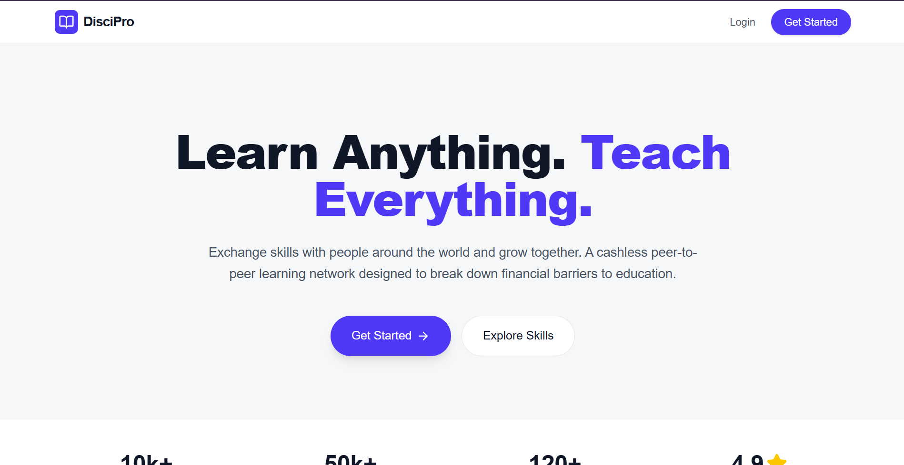
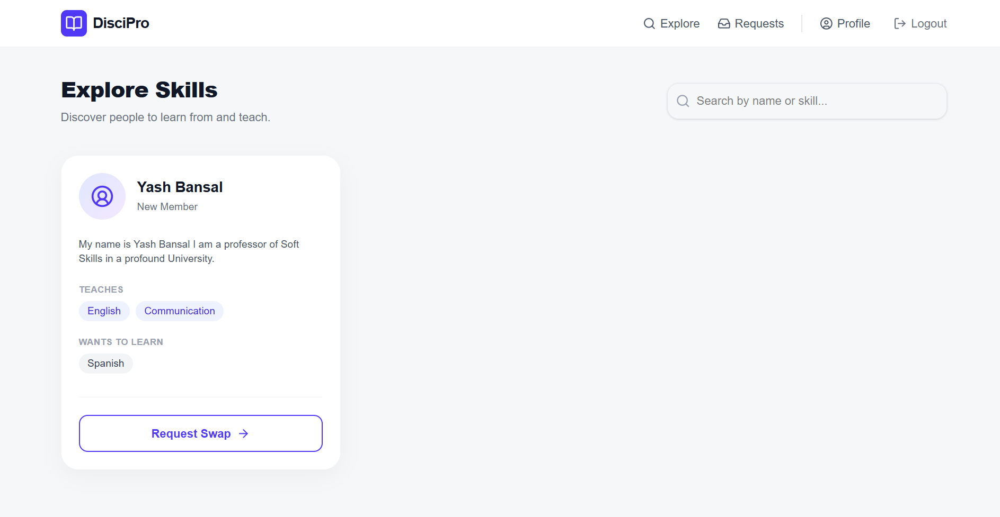
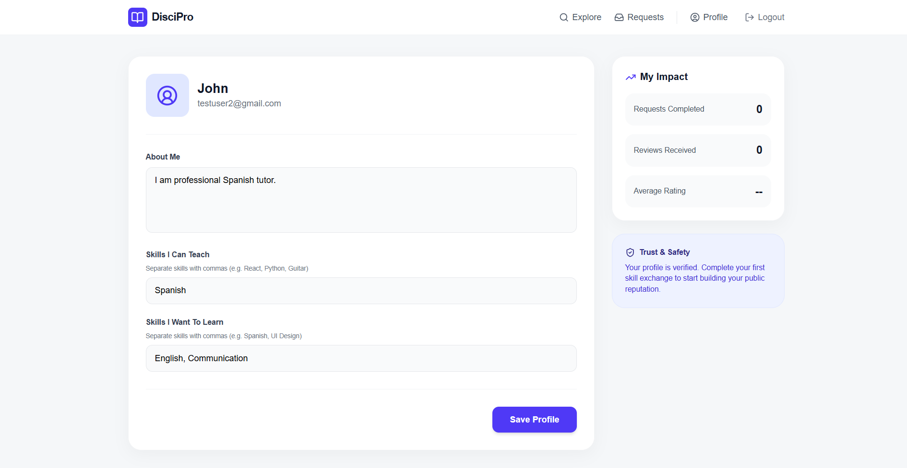
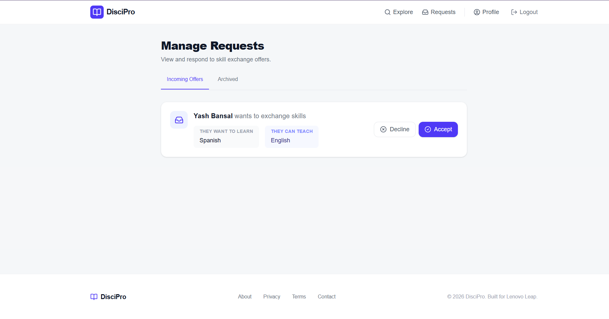

# DisciPro (Phase 0 MVP)

DisciPro is a peer-to-peer skill exchange platform designed to connect individuals looking to learn new skills with those willing to teach them. 

This repository contains the **Phase 0 (Minimum Viable Product)** implementation, developed as part of the Lenovo Leap Internship Capstone.

## 📸 App Interface






## 🚀 Features
- **Secure Authentication:** User registration and login utilizing strict JWT (JSON Web Tokens) and bcrypt password hashing.
- **Profile Management:** Users can customize their bio, and specify the skills they can teach vs. the skills they want to learn.
- **User Discovery:** A dashboard to explore other users on the platform based on their skills.
- **Skill Exchange Requests:** Users can initiate, receive, and manage incoming "Swap Requests" with peers.

## 💻 Tech Stack
- **Frontend:** React.js, Tailwind CSS, Vite, Zustand (State Management), React Router, Lucide Icons.
- **Backend:** Python 3.12, FastAPI, Motor (Async MongoDB), PyJWT, bcrypt.
- **Database:** MongoDB Atlas (Cloud Database).

## 🛠️ How to Run Locally

### Prerequisites
- Node.js & npm
- Python 3.12+
- A MongoDB Atlas account/cluster

### 1. Clone the repository
```bash
git clone https://github.com/yash-Bansal10/DisciPro-MVP.git
cd DisciPro-MVP
```

### 2. Backend Setup
```bash
cd backend
python -m venv venv
venv\Scripts\activate
pip install -r requirements.txt
```

Create a `.env` file inside the `backend` folder with the following variables:
```env
MONGO_URI="your_mongodb_atlas_connection_string"
SECRET_KEY="a_secure_random_string"
ALGORITHM="HS256"
ACCESS_TOKEN_EXPIRE_MINUTES="1440"
```

Start the backend server:
```bash
uvicorn main:app --reload
```

### 3. Frontend Setup
Open a new terminal window:
```bash
cd frontend
npm install
npm run dev
```

The app will be running at `http://localhost:5173/` and the backend API at `http://localhost:8000/`.
